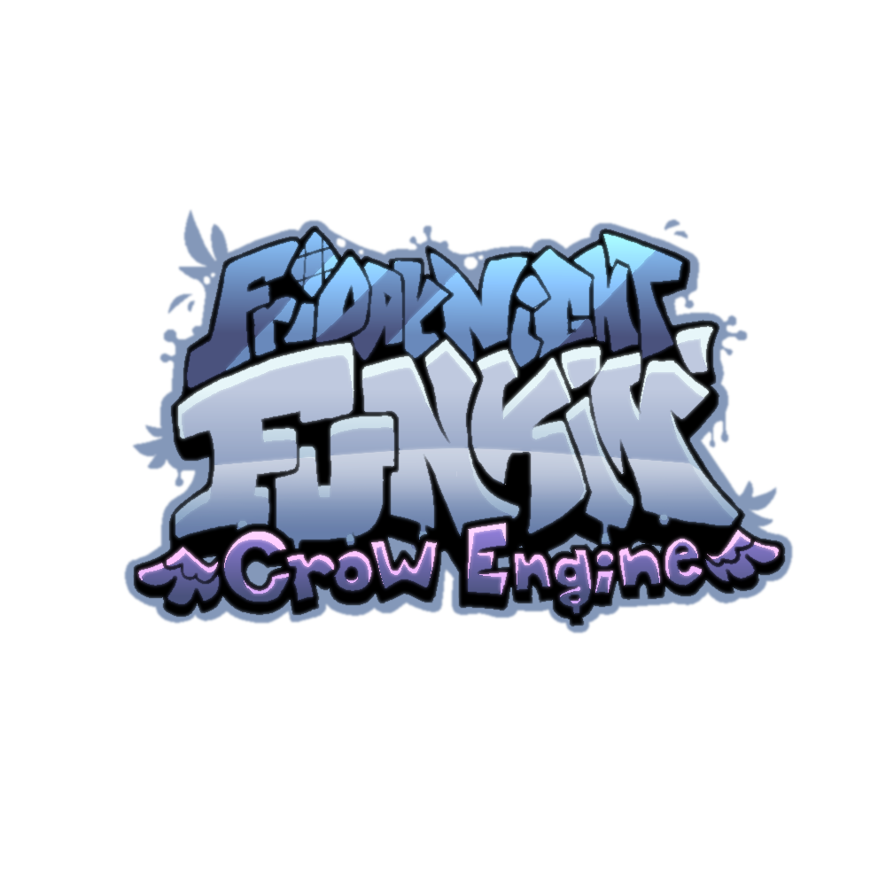

Crow Engine
======

## Info

Crow Engine is a modified version of the game Friday Night Funkin' that has been rebuilt to include comprehensive documentation for modding and to introduce new features. The primary goal of this project is to facilitate a clearer understanding of modding for players and developers.

### Mods currently using Crow Engine

* Chill-Sides
* Undertale Mix Mod (Hypno's Lullaby Cover Mod)
* Mechanics Mod

## Notes

### 0.1.0A:
  * All code used in this project was developed from the ground up, rather than being built upon or modified from preexisting code.

## Credits

The following have contributed to Crow Engine.

* [EyeDaleHim](https://linktr.ee/eyedalehim) - Lead Maintainer & Owner of Crow Engine

* [WeldedFlap](https://weldedflap.carrd.co/) - Major Contributor
